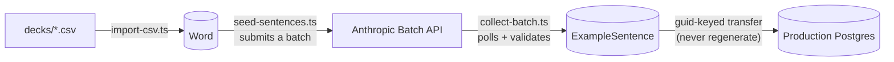

# Architecture

This is Bayana's technical brief: the six decisions that carry most of the codebase, each stated as the choice, the reasoning, and the trade-off accepted, with file paths throughout so nothing has to be taken on faith. [SPEC.md](SPEC.md) is the full design document, with the alternatives analysis in §14 and the dated decision log in [DECISIONS.md](DECISIONS.md); this file is the shorter read.

1. [One full-stack Next.js service](#one-full-stack-nextjs-service), instead of an API plus a frontend
2. [The FSRS adapter is a pure translation layer](#the-fsrs-adapter-is-a-pure-translation-layer), shared by the vocabulary and grammar queues
3. [Review writes are serializable, with retry](#review-writes-are-serializable-with-retry), instead of row locks
4. [Sentences are generated once and cached forever](#sentences-are-generated-once-and-cached-forever), through the Batch API
5. [Distractors are scored, not random](#distractors-are-scored-not-random)
6. [The demo cookie is the whole identity](#the-demo-cookie-is-the-whole-identity)

## One full-stack Next.js service

The whole product is a single Next.js 16 (App Router) deployable: React UI, Prisma to one Postgres instance, and an API surface **split by direction**: reads are Route Handlers under [src/app/api](src/app/api), writes are Server Actions colocated with the route that owns them. No separate backend, no worker tier, no Redis.

The split is deliberate and is written up in SPEC.md §9 and §14.16. Reads keep a URL the browser can cache and a client can re-request imperatively, which two routes depend on directly (`/api/browse` and `/api/words/[id]/sentence` carry `Cache-Control` headers that eliminate repeat round-trips). Writes have none of those properties to lose and gain typed arguments across the boundary. The security note matters more than the ergonomic one: a Server Action compiles to a POST endpoint whose id is discoverable in the client bundle, so it is exactly as web-reachable as the route it replaced and every guard survives unchanged. The typed signature is a developer convenience, never a boundary.

Each study screen builds its first payload **during the page render** and hands it to the client as a prop, awaited in a nested component under `<Suspense>` so the shell paints while only the queue streams. The read routes remain for the imperative refetches ("Check for more", "Play again", retry). This replaced an earlier shape in which every session screen mounted, painted a spinner, and issued a `useEffect` fetch that re-derived the user id the render already knew, which also made `<Link>` prefetching worthless, since prefetching a study route warmed up a spinner.

There is one deliberate exception, and the criterion is payload size rather than page kind (SPEC.md §9.3). `/browse` keeps its client fetch: it holds the whole level because search filters in memory, so N1 is ~2,700 rows and ~90 KB gzipped, and a cookie-reading route's response is not cacheable, so server-rendering it would re-transfer those bytes on every visit to remove one round trip, where a route handler holds them in the browser for a day. What did move onto the render is that response's *per-user* half, the set of words already in the user's deck, which is what had been capping the cache lifetime at an hour. `/grammar/browse` is the same tool at ~220 rows and went the other way, server-rendered in full. The general rule: split a read along the cacheable/per-user seam rather than choosing between the two.

The reasoning is that nothing in the workload earns a second service. There is exactly one client (this frontend), so a public versioned API surface would be overhead with no consumer. The one heavy workload, bulk sentence generation, is delegated to Anthropic's Batch API, which runs asynchronously on Anthropic's side; the usual reason to stand up a worker fleet does not apply. Everything else is a database query or a single LLM call, and FSRS scheduling is pure in-process computation. The full argument, including the conditions under which this would be revisited, is SPEC.md §5.1 and §14.1.

The service is sized to match: the Prisma client rides a `pg` pool capped at 2 connections ([src/lib/db.ts](src/lib/db.ts)), because a single-user app on one Railway instance gains nothing from holding 8 idle connections open. The trade-off is one process and one scaling unit for everything. That is acceptable here, and the data model is framework-agnostic, so extracting a service later is an option rather than a prerequisite.

## The FSRS adapter is a pure translation layer

[src/lib/fsrs.ts](src/lib/fsrs.ts) is the only file that speaks the `ts-fsrs` dialect: snake_case fields, numeric state enums, its `Card` and `ReviewLog` shapes. Everything else in the app deals in Prisma models, so any FSRS quirk lives in exactly one place. The module takes no database access at all, which makes it trivially unit-testable: [src/lib/fsrs.test.ts](src/lib/fsrs.test.ts) round-trips rows through the adapter, because persist-then-restore being lossless is precisely the cycle every card survives between two study sessions, and a silently mis-mapped field would corrupt scheduling state for weeks before anyone noticed.

The adapter accepts a structural `CardLike` type rather than a concrete model, so vocabulary ([src/lib/review.ts](src/lib/review.ts) over `ReviewState`) and grammar ([src/lib/grammar-review.ts](src/lib/grammar-review.ts) over `GrammarProgress`) share one scheduler with per-user tuning (desired retention, optional custom weights). The trade-off accepted is that grammar mirrors the review service rather than generalizing both into one polymorphic card table; the duplication is small and the schema stays obvious.

That structural typing paid off when grammar gained one-step undo. Undo needs the review being reversed, not just the current card, so it needed a `GrammarReviewLog` table mirroring `ReviewLog`. But because the adapter was already model-agnostic, `rollback()` and the `fromLog`/`toLog` mappings served the second queue with **no change to [src/lib/fsrs.ts](src/lib/fsrs.ts) at all**. The cost of the mirroring shows up here too, honestly: `undoLastGrammarReview` is a near-copy of `undoLastReview`, differing only in table and key names, and it was kept as a copy because factoring the two together means passing Prisma delegates around for twenty lines.

Queue building is O(session), not O(backlog): [src/lib/review.ts](src/lib/review.ts) runs a joinless `count()` for the "cards waiting" number in parallel with a `findMany` capped at the session limit, so a user returning from weeks away does not materialize hundreds of joined rows just to be shown 20. New words are a random sample of never-seen words, because the source deck is sorted by reading and insertion order would cluster similar-sounding words together.

## Review writes are serializable, with retry

Every rating is a read-modify-write: read the card's state, run the FSRS math in JavaScript, write the result back. Under Postgres's default READ COMMITTED isolation, two concurrent requests for the same card (a double-tapped rating button) can both read the same original row, and the second write silently discards the first. `serializableTxn` in [src/lib/db.ts](src/lib/db.ts) runs the sequence at SERIALIZABLE isolation instead, so Postgres detects the interleaving and aborts one transaction; the loser surfaces as Prisma error `P2034` and is simply re-run against the now-committed state.

The alternative, `SELECT ... FOR UPDATE` row locking, would need raw SQL through Prisma; retry-on-conflict is the idiomatic Prisma pattern, and the comparison is written up in SPEC.md §14.6. The contract the choice imposes is that the transaction body must be safe to run more than once, and undo shows the discipline end to end: [src/lib/review.ts](src/lib/review.ts) reverts a review by replaying the `ts-fsrs` `rollback` against the stored log row, and a concurrent double-undo that slips past serialization surfaces as `P2025` ("record not found"), which is mapped to "nothing left to undo" rather than a 500. The trade-off is retry cost, negligible here because conflicts only arise from a double-tap and one retry wins.

## Sentences are generated once and cached forever

Every vocabulary word gets one example sentence written by Claude Haiku, pitched to the word's JLPT level, and stored in Postgres as an `ExampleSentence` row that records which model and pipeline produced it. Generation is a seeding pipeline, not a request-time feature: [scripts/seed-sentences.ts](scripts/seed-sentences.ts) submits the words that still lack a sentence as one Anthropic Batch job, and [scripts/collect-batch.ts](scripts/collect-batch.ts) polls until it ends, validates every result, and upserts the survivors. Both are idempotent and re-runnable.

The cost design lives in [src/lib/generate.ts](src/lib/generate.ts): the system prompt is identical across every request and marked for prompt caching, so a batch of thousands pays the system tokens essentially once, and the Batch API halves the rate on top. Validation is strict JSON with every field required and non-empty, so a malformed response is skipped and retried later rather than stored as junk. The measured result for the full five-level seed (~8,100 words) was about $2.55 cumulative (SPEC.md §7.5), which confirms the project's core premise: the contextual-sentence benefit at a near-zero, one-time cost.

The trade-off is that the cache is a paid artifact and must be treated as data, not as derivable state. Production gets the sentences transferred keyed by the stable Anki `guid` rather than regenerated, and the local database holding the cache is the backup target (SPEC.md §12). Its known limit: one sentence per word at launch, with multi-sentence rotation left open in the spec.

## Distractors are scored, not random

A multiple-choice quiz is only as good as its wrong answers. `pickDistractors` in [src/lib/quiz.ts](src/lib/quiz.ts) scores every same-level word for confusability with the target using two signals computable from data already in the row: shared kanji (Jaccard overlap of the kanji sets, weighted 0.65, because 生活 vs 学生 is the classic JLPT mix-up) and reading similarity (normalized edit distance, weighted 0.35, catching phonetic near-misses like 聞く vs 効く). The top ten are shortlisted and sampled at random for variety, with a random fallback so a full question always builds.

Meaning is deliberately not a positive signal: preferring similar meanings would surface options that are also arguably correct, which is unfair rather than hard. Meaning is a guard instead, and candidates whose English gloss tokens overlap the target's beyond a threshold are rejected as risking a second right answer. [src/lib/exam.ts](src/lib/exam.ts) applies the same signals per question type, reading distractors for the kanji-reading section and expression distractors for the kanji-writing section, with its small utility set duplicated from quiz.ts on purpose to keep both modules self-contained until a third consumer appears.

The trade-off accepted, and stated in the code: the guard catches shared words, not pure synonyms ("big" vs "large" would need embeddings), and scoring is O(pool) per question, which is cheap at the roughly 670 to 2,700 words a JLPT level actually contains.

## The demo cookie is the whole identity

There are two ways to be signed in. The real path is a passwordless magic link (Auth.js with the Resend provider, [src/auth.ts](src/auth.ts)) restricted to an email allowlist, which today holds a single address. The demo path has no email, no Auth.js session row, and no server-side session state at all: `POST /api/demo/login` ([src/app/api/demo/login/route.ts](src/app/api/demo/login/route.ts)) creates a fresh `User` plus profile and answers with a cookie of the form `userId:expiresAtMs:hmac`, signed with `AUTH_SECRET`. The cookie is the only key to those rows; lose it and the data is unreachable, which is the design, since demo sessions are meant to be ephemeral. Verification ([src/lib/current-user.ts](src/lib/current-user.ts)) checks the HMAC in constant time before trusting anything, enforces the signed expiry server-side so a captured value cannot be replayed past its lifetime, and fails closed by throwing when `AUTH_SECRET` is missing rather than signing with an empty key. Expired demo rows are deleted opportunistically on each new demo login, with a deliberately narrow filter because every relation cascade-deletes.

The layer above is coarse on purpose. [proxy.ts](proxy.ts) (Next.js 16 renamed `middleware.ts`, which is now silently ignored; SPEC.md §11.9) only checks cookie presence and redirects to sign-in, plus rate limiting for the two abusable endpoints: sign-in emails and demo-user creation, each with a per-IP and a global cap. The per-IP key is the rightmost X-Forwarded-For hop, the one written by Railway's edge, because the leftmost entries are client-supplied and would let an attacker mint a fresh bucket per request. The limiter itself ([src/lib/rate-limit.ts](src/lib/rate-limit.ts)) is a fixed-window counter in process memory. Its known limits are stated in its header: counters reset on every redeploy and are not shared across replicas, acceptable for a single-instance deployment and swappable for a Postgres- or Redis-backed store without touching the call sites. The trade-off of the whole model is a security boundary that lives in server code rather than at the edge, re-verified on every page and API route, with the proxy as UX convenience and flood control only.
